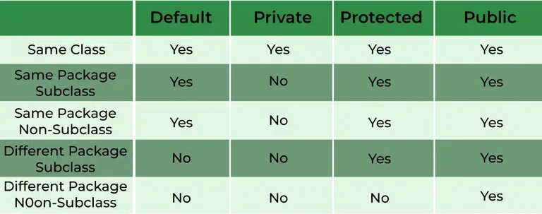

## 1. Write up Example code to demonstrate the three foundmental concepts of OOP. (reference Code Demo repo as example)

    1.  Encapsulation;
    2.  Polymorphism;
    3.  Inheritance;

## 2. What is wrapper class in Java and Why we need wrapper class?

In Java, wrapper classes are part of the java.lang package and provide a way to use primitive data types (int, char,
byte, double, etc.) as objects. Each primitive data type has a corresponding wrapper class

- byte - Byte
- short - Short
- int - Integer
- long - Long
- float - Float
- double - Double
- char - Character
- boolean - Boolean

Java is an object-oriented programming language, and there are situations where we can only use objects. For example,
when working with collection classes like ArrayList, you can't use primitive data types directly because the collections
are designed to hold objects. Wrapper classes allow primitives to be used where objects are required.

## 3. What is the difference between HashMap and HashTable?

A HashTable doesn't allow null keys or values; a HashMap does. A HashTable is synchronized to prevent multiple threads
from accessing it at once; a HashMap isn't.

## 4. What is String pool in Java and why we need String pool?

String pool is a special storage area in Java heap. If the string is already present in the pool, then instead of
creating a new object, old object’s reference is returned. This way different String variables can refer to the same
reference in the pool, thus saving a lot of heapq space.

## 5. What is Java garbage collection?

Garbage collection in java is the process of looking at heap memory, identifying which objects are in use and which are
not and deleting the unused objects. An unused object or unreferenced object, is no longer referenced by any part of
your program.

## 6. What are access modifiers and their scopes in Java?

## 7. What is final key word? (Filed, Method, Class)

The final keyword is a non-access modifier used for a variable, a method, or a class

Use with:

- primitive type variable: its value cannot be changed once assigned
- method: you cannot override the method in the subclass
- class: that class cannot be extended.
- object type: that object cannot be referenced again

## 8. What is static keyword? (Filed, Method, Class). When do we usually use it?

In Java, a static member is a member of a class that isn’t associated with an instance of a class. Instead, the member
belongs to the class itself

The static keyword is commonly used for:

- Constants that should be shared across all instances.
- Utility or helper methods that don't require object state since they don't operate on instance variables.
- Nested classes that don't need access to an enclosing instance's fields and methods.

## 9. What is the differences between overriding and overloading?

- Method Overriding is a Run time polymorphism. In method overriding, the derived class provides the specific
  implementation of the method that is already provided by the base class or parent class.

- Method Overriding is a Run time polymorphism. In method overriding, the derived class provides the specific
  implementation of the method that is already provided by the base class or parent class.

## 10. What is the differences between super and this?

this is to invoke methods of the current class. super is used to invoke methods of the immediate parent class. this is
used to invoke a constructor of the current class. super is used to invoke a constructor of the immediate parent class.

## 11. What is the Java load sequence?

In Java, the term "load sequence" usually refers to the order in which classes are loaded, initialized, and used in a
Java application.

Class Loading -> Linking -> Initialization -> Instantiation -> Usage -> Unloading

## 12. What is Polymorphism ? And how Java implements it ?

Polymorphism is the process that an object or function takes different forms.

2 types of Polymorphism:

1. Compile Time Polymorphism (Method Overloading)
    1. two or more methods in one class have the same method name but different arguments.
    2. It is called as Compile time polymorphism because it is decided at compile time which overloaded method will be
       called.
2. Run Time Polymorphism (Method Overriding)
    1. Overriding means when we have two methods with same name and same parameters in parent and child class.
    2. Through overriding, child class can provide specific implementation for the method which is already defined in
       the parent class.

## 13. What is Encapsulation ? How Java implements it? And why we need encapsulation?

Encapsulation is a process of binding data and methods within a class.

In Java, encapsulation is implemented through the use of access modifiers with classes, methods, and variables. The four
access modifiers in Java are:

- private: The attribute or method can be accessed only within its own class.
- default (no modifier): The attribute or method can be accessed only by classes in the same package.
- protected: The attribute or method can be accessed within its own package and by subclasses of its class in other
  packages.
- public: The attribute or method can be accessed by any other class.

Encapsulating the data (variables) and code (methods) into a single unit (class) keeps the data safe from outside
interference and misuse. Only the methods intended for that purpose (getters and setters) can interact with the data,
preventing unintended or harmful modifications. Data encapsulation led to the important OOP concept of data hiding.

## 14. What is Interface and what is abstract class? What are the differences between them?
In Java, both interfaces and abstract classes are used to achieve abstraction, where you define the required structure for subclasses without providing a complete implementation.

Interface:
- An interface in Java is a reference type that can contain only constants, method signatures, default methods, static methods, and nested types. Interfaces cannot contain instance fields. The methods in interfaces are abstract by default, which means they do not have a body and must be implemented by classes that choose to implement the interface.
- Interfaces support multiple implementations. A class can implement multiple interfaces, thereby achieving multiple inheritance.
- Use an interface when you expect unrelated classes to implement your interface.

Abstract class:
- An abstract class in Java is a class that cannot be instantiated on its own and must be subclassed. It may contain abstract methods (without an implementation) as well as concrete methods (with an implementation). Abstract classes are used when you want to share code among several closely related classes.
- Use an abstract class when you want to share code among several closely related classes, and when it makes sense for the classes to share a common superclass.
## 15. design a parking lot (put the code to codingQuestions/coding1 folder, )

    1.  If you have no ability to design it, please find the solution in internet, then understand it, and re-type
    it.(Do NOT just copy and paste)

## 16. What are Queue interface implementations and what are the differences and when to use what? 
The Queue interface in Java is part of the Java Collections Framework and represents a collection designed for holding elements prior to processing. It operates in a FIFO (first-in-first-out) manner. 

Main Queue Implementations:
1. LinkedList
2. PriorityQueue
3. ArrayDeque
4. LinkedBlockingQueue
5. ArrayBlockingQueue
6. PriorityBlockingQueue
7. DelayQueue